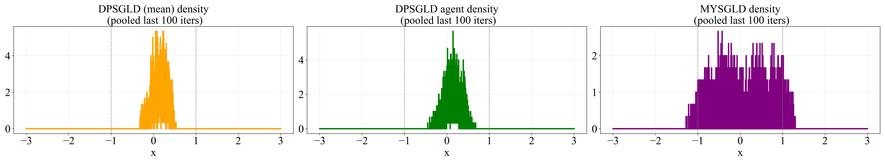

---
title: "Decentralized Proximal Stochastic Gradient Langevin Dynamics" 
categories: [Bayesian Inference, Sampling, MCMC, Theoretical Machine Learning]
author: 
  - Mohammad Rafiqul Islam 
  - Mert Gurbuzbalaban
  - Lingjiong Zhu
date: "01/06/2026"
image: 1dsampling_density_compare.png
citation: true
---  

Ongoing research. The details will be available soon.  

  
