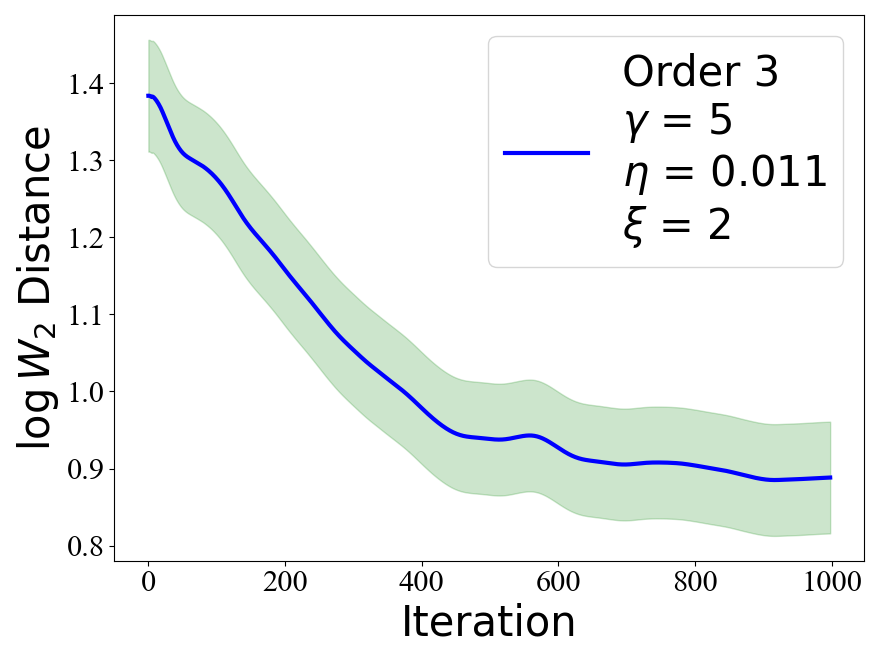
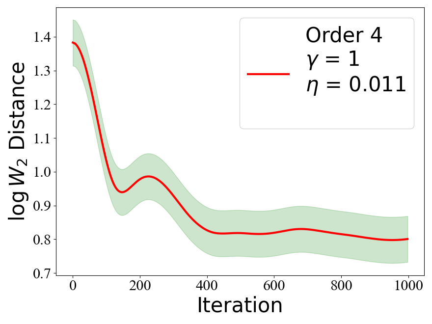
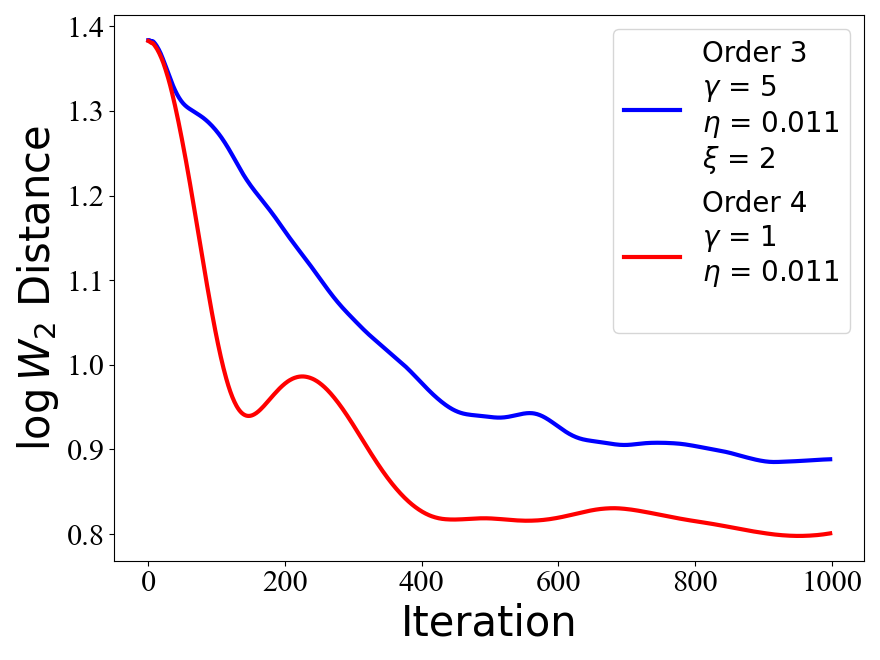

---
title: "Higher-order Langevin Algorithms" 
categories: [Bayesian Inference, Sampling, MCMC, Theoretical Machine Learning]
author: 
  - Thanh L. Dang
  - Mert Gurbuzbalaban
  - Mohammad Rafiqul Islam 
  - Nihan Yao 
  - Lingjiong Zhu
date: "07/23/2025"
image: o3o4reg.png
citation: true
---  

<p style="text-align:justify">
Langevin algorithms are popular Markov chain Monte Carlo (MCMC) methods
for large-scale sampling problems that often arise in data science. 
We propose Monte Carlo algorithms based
on $P$-th order Langevin dynamics for any $P\geq 3$. Our design of $P$-th order Langevin Monte Carlo (LMC) algorithms is by combining splitting and accurate integration methods. 
We obtain Wasserstein convergence guarantees for sampling from distributions with log-concave and smooth densities. Specifically, the mixing time of the $P$-th order LMC algorithm scales as $O\left(d^{\frac{1}{\mathcal{R}}}/\epsilon^{\frac{1}{2\mathcal{R}}} \right)$ for $\mathcal{R}=4\cdot\mathbf{1}_{\{ P=3\}}+ (2P-1)\cdot\mathbf{1}_{\{ P\geq 4\}}$, which have better dependence on the dimension and the accuracy level as $P$ grows. Numerical experiments illustrate the efficiency of
our proposed algorithms.
</p>  

<p float="left">
    
    
    
</p>

```{=html}
<div class="text-center">
    <a class="arxiv-button" href="https://arxiv.org/abs/2508.17545" target="_blank">
        
    </a>

    <a class="pdf-button" href="/_assets/documents/2508.17545v1.pdf" target="_blank">
        
    </a>
</div>
```  

--- 

**Share on**  

::::{.columns}
:::{.column width="33%"}
<a href="https://www.facebook.com/sharer.php?u=https://rispace.github.io/research/holmc/" target="_blank" style="color:#1877F2; text-decoration: none;">
 

</a>
 
:::
 
:::{.column width="33%"}
<a href="https://www.linkedin.com/sharing/share-offsite/?url=https://rispace.github.io/research/holmc/" target="_blank" style="color:#0077B5; text-decoration: none;">
 

</a>
 
:::
 
:::{.column width="33%"}
<a href="https://www.twitter.com/intent/tweet?url=https://rispace.github.io/research/holmc/" target="_blank" style="color:#1DA1F2; text-decoration: none;">
 

</a>
 
:::
::::
 
<script src="https://giscus.app/client.js"
        data-repo="rispace/rispace.github.io"
        data-repo-id="R_kgDOPdB7AQ"
        data-category="Ideas"
        data-category-id="DIC_kwDOPdB7Ac4CuMVL"
        data-mapping="pathname"
        data-strict="0"
        data-reactions-enabled="1"
        data-emit-metadata="0"
        data-input-position="bottom"
        data-theme="light"
        data-lang="en"
        crossorigin="anonymous"
        async>
</script>
 
<div id="fb-root"></div>
<script async defer crossorigin="anonymous"
 src="https://connect.facebook.net/en_US/sdk.js#xfbml=1&version=v20.0"></script>
<div class="fb-comments" data-href="https://rispace.github.io/research/holmc/" data-width="750" data-numposts="5"></div>