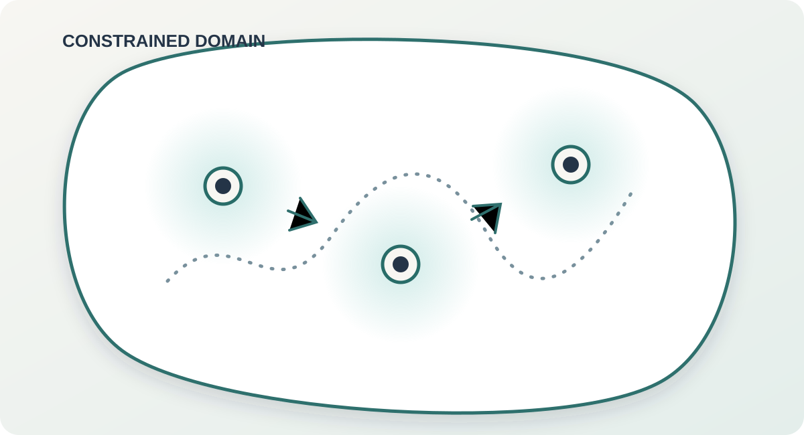

{.research-hero}

## The problem

Many sampling and molecular-dynamics problems describe particles that diffuse inside a constrained region while strongly repelling one another at short distances. The constraint keeps the system inside its admissible domain; the singular interaction makes collisions energetically impossible. Together they create a delicate mathematical and computational problem: the state space is constrained, yet removing collision configurations can make it nonconvex.

## Why standard updates break down

A direct explicit step may place too much probability near a collision, causing important energy or force averages to diverge even when an exact collision has probability zero. Adding an ordinary projection is not enough: when particles cross, projection onto an ordering constraint can collapse them to the same position and create a collision itself.

## Our approach

We are developing a tamed-proximal Langevin method that incorporates the singular repulsion directly into the numerical update while enforcing the outer constraint. The goal is a scheme that remains collision-free, is stable near singular configurations, and faithfully samples the intended equilibrium distribution.

## Research goals

- Establish well-posedness and collision avoidance for the constrained stochastic dynamics.
- Identify conditions guaranteeing the desired invariant distribution.
- Design a practical discretization that controls singular forces without artificial collisions.
- Prove quantitative convergence and discretization-error guarantees.

This is ongoing work with **David P. Herzog** at Iowa State University.
